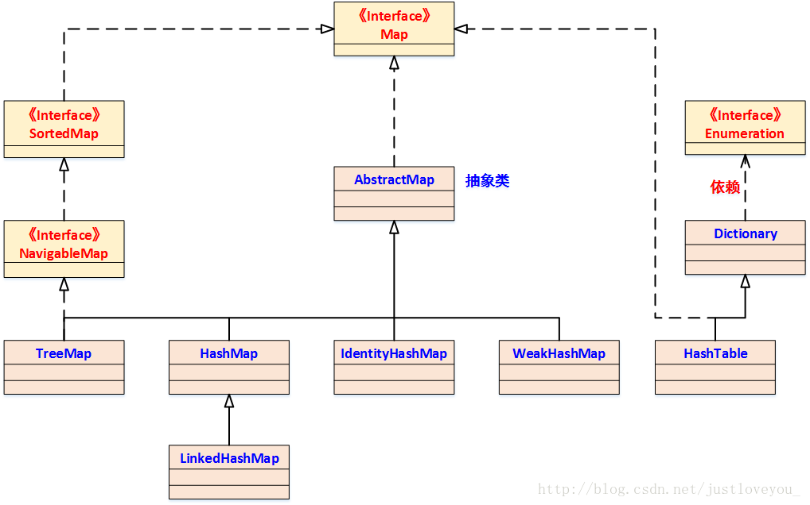
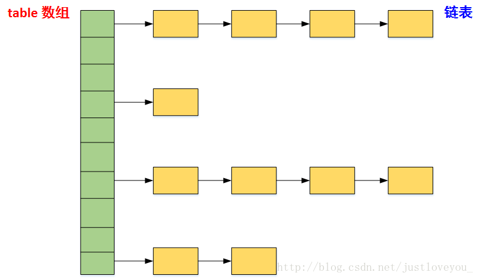
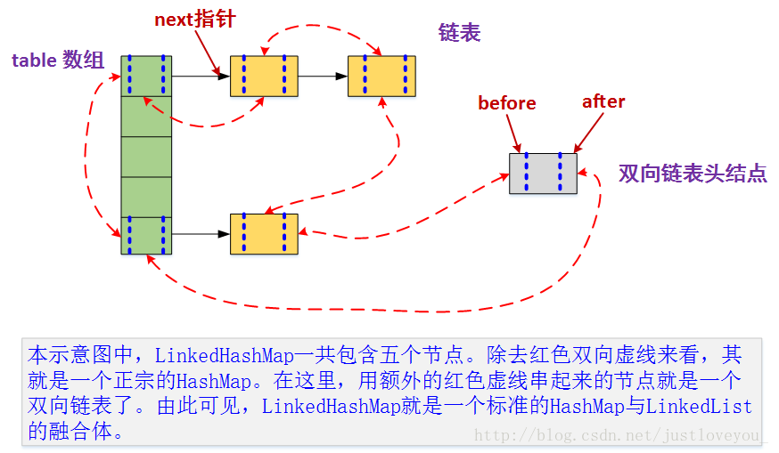

# map简介


## hashMap
数据结构是数组+链表。


### put元素的流程
首先根据对象计算hashcode值，映射到map中数组的下标，如果改数组没有元素，直接放置。如果有元素，说明有hash冲突，放到数组下标对应的链表上。

### get元素的逻辑
首先根据对象计算hashcode值，映射到map中数组的下标。如果是一个元素，就直接返回。如果是一个链表，遍历链表，根据key值判断元素，返回。不存在hash冲突的情况下，时间复杂度是o(1)。

### hash冲突、hash碰撞
碰撞处理：常用的有两种方式，一种是open hashing，即 >拉链法；另一种就是 closed hashing，即开地址法(opened addressing)。

### hashmap负载因子为什么是0.75
hashmap容量永远不会用完，当容量达到0.75的时候就会扩容，也就意味着四分之一的空间浪费。
当数组下标剩余很少的时候，出现hash冲突的概率大大增加。0.75是统计学的数据，是空间和效率之间的一个平衡值。

## LinkedHashMap
LinkedHashMap继承与hashMap，将HashMap和双向链表合二为一。LinkedHashMap 在不对HashMap做任何改变的基础上，给HashMap的任意两个节点间加了两条连线(before指针和after指针)，使这些节点形成一个双向链表。在LinkedHashMapMap中，所有put进来的Entry都保存在HashMap中，但由于它又额外定义了一个以head为头结点的空的双向链表，因此对于每次put进来Entry还会将其插入到双向链表的尾部



## TreeMap
底层数据结构是红黑树。
TreeMap是如何保证其迭代输出是有序的呢？其实从宏观上来讲，就相当于树的中序遍历(LDR)


## map最高效的遍历方式：
使用 entrySet 遍历 Map 类集合 KV，而不是 keySet 方式进行遍历。
说明：keySet 其实是遍历了 2 次，一次是转为 Iterator 对象，另一次是从hashMap中取出 key 所对应的 value。而entrySet只是遍历了一次就把 key 和 value 都放到了entry中，效率更高。如果是 JDK8，使用 Map.foreach 方法。
```java
    Map<String, String> map = new HashMap<>();
    map.put("aa", "111");
    map.put("bb", "222");
    map.put("cc", "333");
    for (Map.Entry<String, String> m : map.entrySet()) {
        String key = m.getKey();
        String value = m.getValue();
        System.out.println("key==" + key + " value==" + value);
    }

```


## map中key-value是否可以为空

集合类 | key | value | superclass | 说明
----|-----|-------|------------|---
HashTable | 不可以 | 不可以 | Dictionary | 线程安全
ConcurrentHashMap | 不可以 | 不可以 | AbstractMap | 分段锁技术
TreeMap | 不可以 | 可以 | AbstractMap | 不安全
HashMap | 可以 | 可以 | AbstractMap | 不安全
LinkedHashMap | 可以 | 可以 | AbstractMap | 不安全