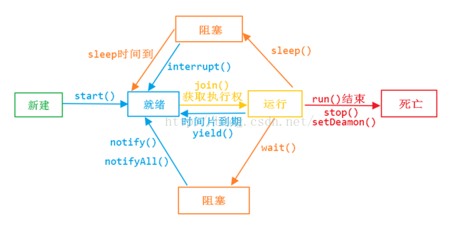

# java多线程
## 线程和进程
## 线程的生命周期

1. 新建状态
2. 就绪状态
3. 运行状态
4. 阻塞状态
5. 死亡状态

## 如何启动和销毁线程
1. 使用start方法启动线程
2. 销毁线程有三种
    * 使用变量标志
    * 使用stop（不推荐使用）
    * 使用interrupt

## 如何判断线程的状态


## interrupt、interrupted 、isInterrupted 区别
interrupt()进行线程中断，调用该方法的线程的状态为将被置为"中断"状态
interrupted 是作用于当前线程，会清除中断状态
isInterrupted 是作用于调用该方法的线程对象所对应的线程
## 多线程的实现方式
1. 继承Thread类
2. 实现Runnable接口
## 同步的方式
1. syncronized方法
## 悲观锁和乐观锁
1. 悲观锁（synchronized）
    读锁和读锁互斥，性能低
    一个线程获得锁，其他线程只能等待
    自动释放锁
2. 乐观锁（ReentrantLock）
    读锁不互斥，性能高
    实现非公平锁和公平锁，读写锁
    手动控制释放锁
    可以中断等待线程

## 公平锁和非公平锁
* 公平锁：按照等待锁的顺序获取锁
* 非公平所锁：随机获取锁

## 死锁
## 线程池的使用和原理
1. corePoolSize：线程池中的核心线程数，当提交一个任务时，线程池创建一个新线程执行任务，直到当前线程数等于corePoolSize；
如果当前线程数为corePoolSize，继续提交的任务被保存到阻塞队列中，等待被执行；
如果执行了线程池的prestartAllCoreThreads()方法，线程池会提前创建并启动所有核心线程。

2. maximumPoolSize：线程池中允许的最大线程数。如果当前阻塞队列满了，且继续提交任务，则创建新的线程执行任务，前提是当前线程数小于maximumPoolSize

3. keepAliveTime：线程空闲时的存活时间，即当线程没有任务执行时，继续存活的时间。默认情况下，该参数只在线程数大于corePoolSize时才有用

4. workQueue：必须是BlockingQueue阻塞队列。当线程池中的线程数超过它的corePoolSize的时候，线程会进入阻塞队列进行阻塞等待。通过workQueue，线程池实现了阻塞功能
5. RejectedExecutionHandler（饱和策略）
线程池的饱和策略，当阻塞队列满了，且没有空闲的工作线程，如果继续提交任务，必须采取一种策略处理该任务，线程池提供了5种策略：
    * （1）AbortPolicy：直接抛出异常，默认策略；
    * （2）CallerRunsPolicy：用调用者所在的线程来执行任务；
    * （3）DiscardOldestPolicy：丢弃阻塞队列中靠最前的任务，并执行当前任务；
    * （4）DiscardPolicy：直接丢弃任务；
    * （5）实现RejectedExecutionHandler接口，自定义饱和策略

### 几种排队的策略：
1. 不排队，直接提交
将任务直接交给线程处理而不保持它们，可使用SynchronousQueue
如果不存在可用于立即运行任务的线程（即线程池中的线程都在工作），则试图把任务加入缓冲队列将会失败，因此会构造一个新的线程来处理新添加的任务，并将其加入到线程池中（corePoolSize-->maximumPoolSize扩容）
Executors.newCachedThreadPool()采用的便是这种策略

2. 无界队列
可以使用LinkedBlockingQueue（基于链表的有界队列，FIFO），理论上是该队列可以对无限多的任务排队，将导致在所有corePoolSize线程都工作的情况下将新任务加入到队列中。这样，创建的线程就不会超过corePoolSize，也因此，maximumPoolSize的值也就无效了

3. 有界队列
可以使用ArrayBlockingQueue（基于数组结构的有界队列，FIFO），并指定队列的最大长度
使用有界队列可以防止资源耗尽，但也会造成超过队列大小和maximumPoolSize后，提交的任务被拒绝的问题，比较难调整和控制。

### execute 和 submit接口的区别
1. 接受参数，前者是Runnable接口，后者是Callable接口
2. 返回值，前者没有返回值，后者返回Futrue对象
3. 处理异常

### 线程池终止的方法
1. shutdown
2. shutdownNow

## FixedThreadPool
固定线程池大小的，队列可以是有界也可以无界
## CachedThreadPool
大小无界的线程池，队列是无界的

## SingleThreadExecutor
线程池大小为1，

## ScheduledThreadPoolExecutor
执行定时任务的线程池

## 实现生产者消费者
```java
public class Restaurant {
    Meal meal;
    WaitPerson waitPerson = new WaitPerson(this);
    ExecutorService exec = Executors.newCachedThreadPool();
    Chef chef = new Chef(this);
    public Restaurant(){
        exec.execute(waitPerson);
        exec.execute(chef);
    }
    public static void main(String[] args) {
        new Restaurant();
    }
}
class Meal{
    private final int orderNum;
    public Meal(int orderNum){
        this.orderNum = orderNum;
    }
    @Override
    public String toString() {
        return "Meal "+ orderNum;
    }
}
class WaitPerson implements Runnable{
    private Restaurant restaurant;
    public WaitPerson(Restaurant r){
        this.restaurant = r;
    }
    @Override
    public void run() {
        try {
            while(!Thread.interrupted()){
                synchronized (this){
                    while (restaurant.meal==null){
                        wait();
                    }
                    System.out.println("waitPerson get"+ restaurant.meal);
                }
                synchronized (restaurant.chef){
                    restaurant.meal = null;
                    restaurant.chef.notifyAll();
                }
            }
        }catch (InterruptedException e){
            System.out.println(" waitPerson interrupted");
        }
    }
}
class Chef implements Runnable{
    private Restaurant restaurant;
    private int count = 0;
    public Chef(Restaurant r){
        this.restaurant = r;
    }
    @Override
    public void run() {
        try {
            while(!Thread.interrupted()){
                synchronized (this){
                    while (restaurant.meal!=null){
                        wait();
                    }
                }
                if(++count == 10){
                    System.out.println("out of food, closing");
                    restaurant.exec.shutdownNow();
                }
                System.out.println("Order up!");
                synchronized (restaurant.waitPerson){
                    restaurant.meal = new Meal(count);
                    restaurant.waitPerson.notifyAll();
                }
                TimeUnit.MILLISECONDS.sleep(100);
            }
        }catch (InterruptedException e){
            System.out.println(" chef interrupted");
        }
    }
}
```

## CAS操作与ABA问题
CAS操作是jdk新的cpu指令，
